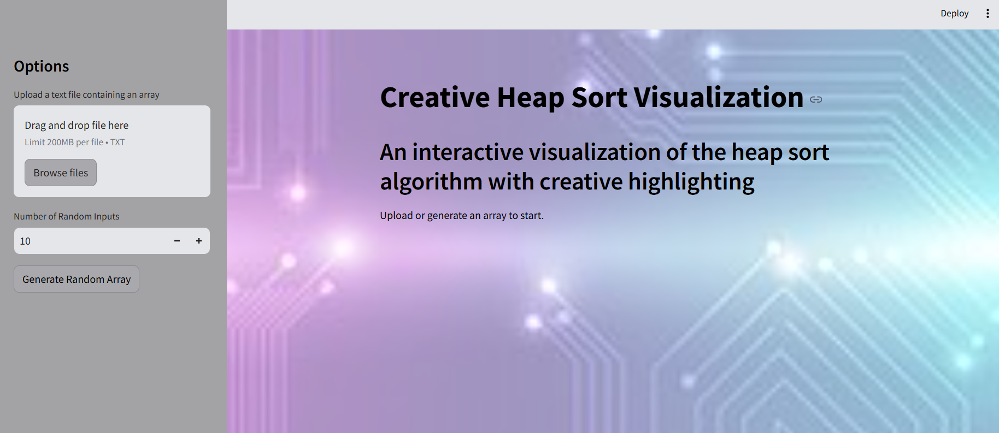
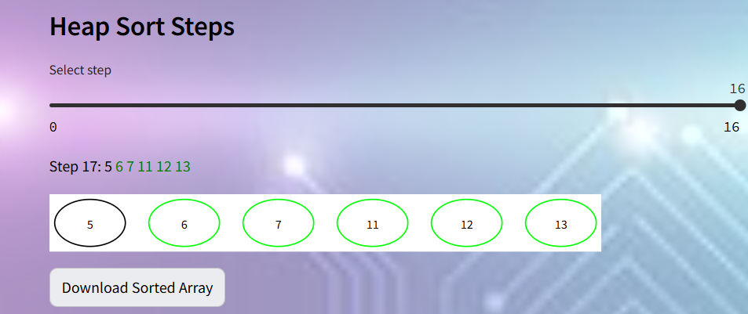
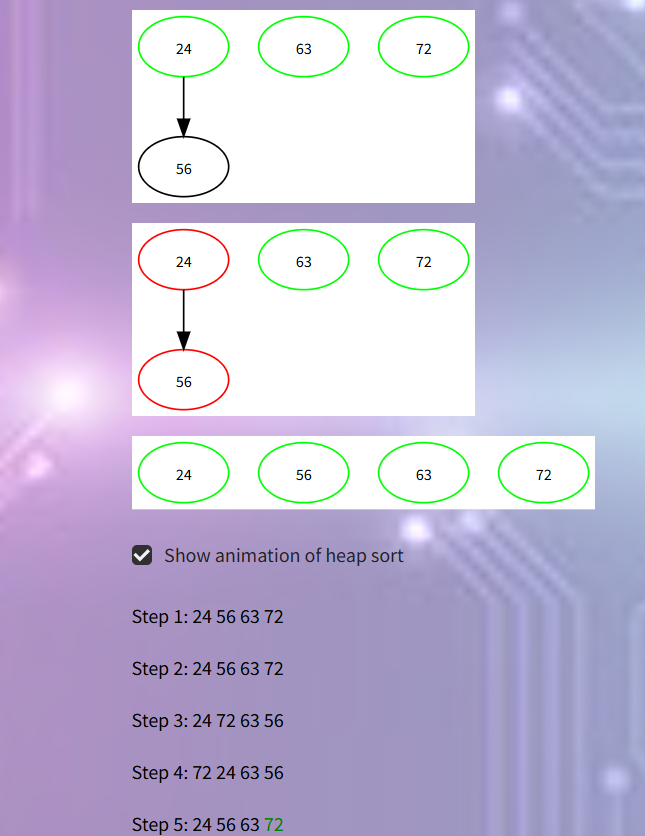
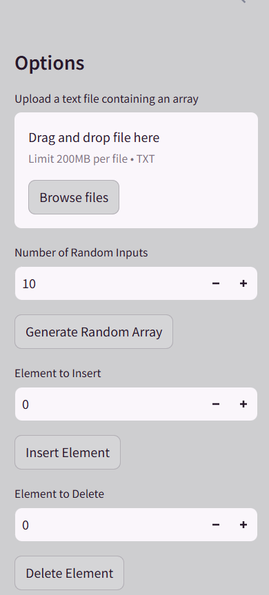
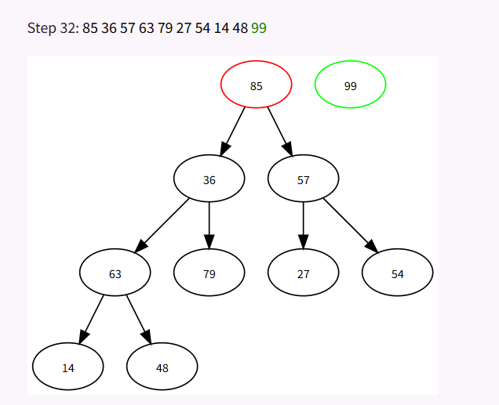

# 🔥 Heap Sort Visualization 🚀

## 🌟 Overview
The Heap Sort Visualization is an interactive tool designed to help users understand the Heap Sort algorithm through animated visualizations. The project allows users to input custom data or use randomly generated data and visualize the sorting process in real-time with both **Top-Down** and **Bottom-Up** approaches.

This project demonstrates the heap sort algorithm with a visual representation of array states at each step, offering valuable insights into the inner workings of the algorithm.

## ⚙ Installation

1. **Clone the Repository**
   ```sh
   git clone https://github.com/YOUR_GITHUB_USERNAME/Heap-Sort-Visualization.git
   cd Heap-Sort-Visualization
   ```

2. **Create a Virtual Environment**
   ```sh
   python -m venv env
   ```

3. **Activate the Virtual Environment**
   - On **Windows**:
     ```sh
     env\Scripts\activate
     ```
   - On **Mac/Linux**:
     ```sh
     source env/bin/activate
     ```

4. **Install Dependencies**
   ```sh
   pip install -r requirements.txt
   ```

5. **Run the Application**
   ```sh
   streamlit run app.py
   ```

## ✨ Features

### 1. Real-Time Visualization
- **Top-Down Heap Sort** and **Bottom-Up Heap Sort** visualizations.
- Color-coded array elements at each step to highlight swaps and the current index.
- Interactive steps with dynamic progress through the sorting process.



### 2. Custom and Random Input Support
- Upload a **custom array** or generate a **random array**.
- Insert or delete elements from the array dynamically.



### 3. Download Sorted Array
- After the sorting process is completed, the sorted array can be **downloaded as a .txt file**.



### 4. Creative Styling
- The app features a **custom background image** and **transparent sidebar** for a visually appealing interface.



### 5. Animation and Step Control
- Users can **control the pace** of the visualization with a slider for step navigation.
- Option to view **animated steps** for a complete heap sort animation.



## 🛠 Technologies Used
- 🐍 **Python**: Main programming language for the heap sort logic.
- 🌐 **Streamlit**: Web framework for building the interactive interface.
- 📊 **Graphviz**: Visualization library for displaying the heap and the sorting process.
- 🖼 **PIL (Pillow)**: For handling image encoding and custom app styling.


## 🎯 Usage
- Open the web application in your browser.
- Choose **random or custom input**.
- Start the **heap sort visualization**.
- Adjust **animation speed** and **step through sorting manually**.
- Download the **sorted array** if needed.

## Contributors
🚀 Project Head: **Ananya G Shetty**

---

